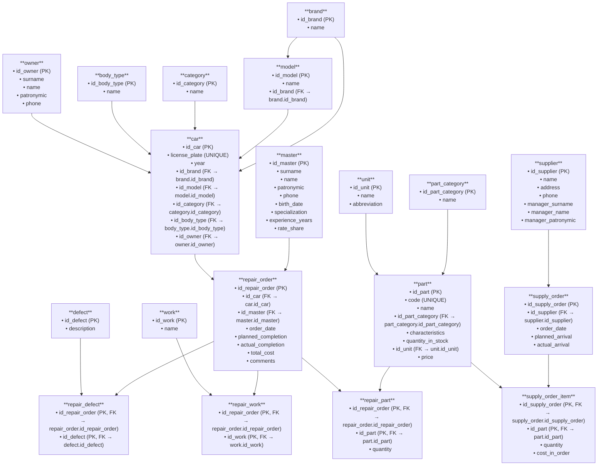

# Схема бд

```mermaid
graph TD
    brand["**brand**
    • id_brand (PK)
    • name"]
    
    model["**model**
    • id_model (PK)
    • name
    • id_brand (FK → brand.id_brand)"]
    
    category["**category**
    • id_category (PK)
    • name"]
    
    body_type["**body_type**
    • id_body_type (PK)
    • name"]
    
    unit["**unit**
    • id_unit (PK)
    • name
    • abbreviation"]
    
    part_category["**part_category**
    • id_part_category (PK)
    • name"]
    
    work["**work**
    • id_work (PK)
    • name"]
    
    defect["**defect**
    • id_defect (PK)
    • description"]

    owner["**owner**
    • id_owner (PK)
    • surname
    • name
    • patronymic
    • phone"]
    
    car["**car**
    • id_car (PK)
    • license_plate (UNIQUE)
    • year
    • id_brand (FK → brand.id_brand)
    • id_model (FK → model.id_model)
    • id_category (FK → category.id_category)
    • id_body_type (FK → body_type.id_body_type)
    • id_owner (FK → owner.id_owner)"]
    
    master["**master**
    • id_master (PK)
    • surname
    • name
    • patronymic
    • phone
    • birth_date
    • specialization
    • experience_years
    • rate_share"]
    
    part["**part**
    • id_part (PK)
    • code (UNIQUE)
    • name
    • id_part_category (FK → part_category.id_part_category)
    • characteristics
    • quantity_in_stock
    • id_unit (FK → unit.id_unit)
    • price"]
    
    supplier["**supplier**
    • id_supplier (PK)
    • name
    • address
    • phone
    • manager_surname
    • manager_name
    • manager_patronymic"]

    supply_order["**supply_order**
    • id_supply_order (PK)
    • id_supplier (FK → supplier.id_supplier)
    • order_date
    • planned_arrival
    • actual_arrival"]
    
    supply_order_item["**supply_order_item**
    • id_supply_order (PK, FK → supply_order.id_supply_order)
    • id_part (PK, FK → part.id_part)
    • quantity
    • cost_in_order"]

    repair_order["**repair_order**
    • id_repair_order (PK)
    • id_car (FK → car.id_car)
    • id_master (FK → master.id_master)
    • order_date
    • planned_completion
    • actual_completion
    • total_cost
    • comments"]
    
    repair_defect["**repair_defect**
    • id_repair_order (PK, FK → repair_order.id_repair_order)
    • id_defect (PK, FK → defect.id_defect)"]
    
    repair_work["**repair_work**
    • id_repair_order (PK, FK → repair_order.id_repair_order)
    • id_work (PK, FK → work.id_work)"]
    
    repair_part["**repair_part**
    • id_repair_order (PK, FK → repair_order.id_repair_order)
    • id_part (PK, FK → part.id_part)
    • quantity"]

    %% Связи
    brand --> model
    brand --> car
    model --> car
    category --> car
    body_type --> car
    part_category --> part
    unit --> part
    owner --> car
    master --> repair_order
    car --> repair_order
    part --> repair_part
    repair_order --> repair_part
    supplier --> supply_order
    supply_order --> supply_order_item
    part --> supply_order_item
    repair_order --> repair_defect
    defect --> repair_defect
    repair_order --> repair_work
    work --> repair_work
```
